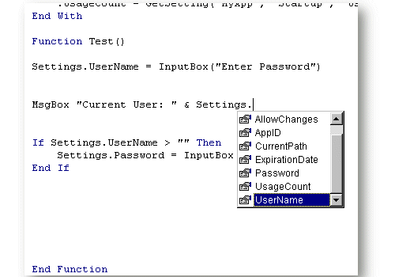



## Create your own data types \- A basic User Defined Type tutorial

### Description

Explains how to create your own custom variable packages that store various data types in one variable and display the elements in the IDE drop-down list while coding. This is a seldom used but very powerful data type in Visual Basic.
 
### More Info
 

             |
---                |---
**Submitted On**   |2000-05-26 02:09:50
**By**             |[Matthew Roberts](https://github.com/Planet-Source-Code/PSCIndex/blob/master/ByAuthor/matthew-roberts.md)
**Level**          |Intermediate
**User Rating**    |3.8 (34 globes from 9 users)
**Compatibility**  |VB 3\.0, VB 4\.0 \(16\-bit\), VB 4\.0 \(32\-bit\), VB 5\.0, VB 6\.0
**Category**       |[Data Structures](https://github.com/Planet-Source-Code/PSCIndex/blob/master/ByCategory/data-structures__1-33.md)
**World**          |[Visual Basic](https://github.com/Planet-Source-Code/PSCIndex/blob/master/ByWorld/visual-basic.md)
**Archive File**   |[CODE\_UPLOAD61105262000\.zip](https://github.com/Planet-Source-Code/matthew-roberts-create-your-own-data-types-a-basic-user-defined-type-tutorial__1-8370/archive/master.zip)

